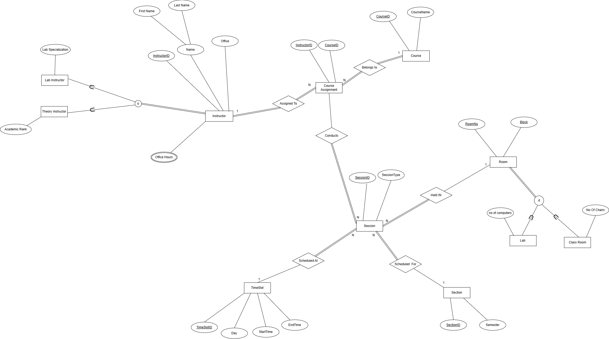

# Timetable Management System (SQL Server)

This project is a SQL-based academic scheduling system designed to manage and organize university timetables. It ensures that sessions (lectures and labs) are scheduled without conflicts, while properly tracking instructors, courses, student sections, rooms, and time slots.

---

## 📌 Overview

- Each instructor can teach one or more courses  
- Courses can be taught by multiple instructors  
- Theory and lab sessions are scheduled in separate spaces with dedicated rules  
- Time slots and room assignments are conflict-free using constraints and checks  
- Views and stored procedures are used to retrieve structured outputs  

---

## 🗂️ Folder Structure

timetable-management-system/
├── sql/
│ ├── 1_schema.sql -- Table definitions (schema, constraints)
│ ├── 2_views.sql -- View definitions
│ ├── 3_procedures.sql -- Stored procedures
│ ├── 4_sample_data.sql -- Sample data for testing
│
└── docs/
└── ERD.png -- Entity-Relationship Diagram

---

## 🛠️ Technologies Used

- **SQL Server**
- **T-SQL (Transact-SQL)** – Microsoft's procedural extension to SQL for control flow, error handling, variables, and stored procedures
- **ERD Modeling**

---

## 🧱 Key Components

### 📋 Tables
- `Instructor`, `TheoryInstructor`, `LabInstructor`
- `Course`, `Course_Assignment`
- `Section`, `Session`, `TimeSlot`, `ClassRoom`, `Lab`
- `OfficeHours`

### 🔍 Views
- `OngoingTheorySessions`
- `OngoingLabSessions`
- `CourseAllocationView`
- `InstructorLoadView`
- `InstructorOfficeHours`

### ⚙️ Stored Procedures
- `AssignCourseToInstructor`
- `InsertNewTheoryInstructor`
- `ScheduleTheorySession`
- `AvailableLabSlots`
- `GetInstructorSchedule`

---

## 🚀 How to Run

1. Open **SQL Server Management Studio**
2. Execute the following files in order:
   - `1_schema.sql`
   - `2_views.sql`
   - `3_procedures.sql`
   - `4_sample_data.sql`
3. Use `SELECT` queries to retrieve data from views like:
   ```sql
   SELECT * FROM OngoingTheorySessions;
   SELECT * FROM InstructorOfficeHours;
4. Execute stored procedures with sample inputs:
   ```sql
   EXEC GetInstructorSchedule 'I001';
   EXEC AvailableLabSlots 'L02', 'A';
   EXEC AssignCourseToInstructor 'I004', 'CS101';
   EXEC InsertNewTheoryInstructor 'I006', 'Ayesha', 'Raza', 'B12', 'Lecturer';

## 📊 ERD Diagram

The Entity Relationship Diagram illustrates the structure and relationships between entities like instructors, courses, and sessions.



---
## 👤 Author

**Muhammad Danish Jawad**  
[GitHub Profile](https://github.com/danishjawad)
